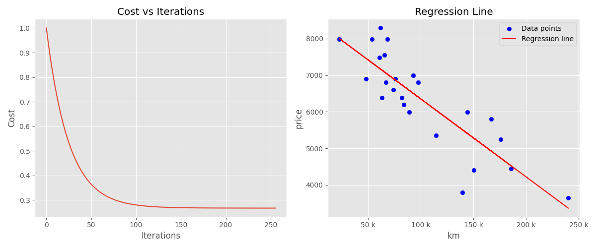

# 🚗 ft_linear_regression: An Introduction to Machine Learning

This project introduces the basic concepts of machine learning by building a **simple linear regression model.** The goal is to predict the price of a car based on its mileage using a gradient descent algorithm.

## 📋 Key Features:

1. Implement **linear regression** with a single feature (mileage).
2. Use gradient descent to train the model and minimize the cost.
3. Predict car prices based on the learned parameters.
4. ave the trained model parameters for future use.

## 🛠️ Project Structure

### Programs
The project contains two main programs:

1. Training Program (`training_model.py`):

    - Reads the dataset containing mileage and price data.
    - Trains a linear regression model using gradient descent.
    - Saves the model parameters (w and b) to a file (`weights.txt`).

2. Prediction Program (`price_pred.py`):

    - Loads the trained model parameters from `weights.txt`.
    - Prompts the user for a mileage input.
    - Predicts and displays the car price for the given mileage.
    - Optionally, visualizes the regression line against the dataset.

### Additional Features
- Bonus 1: Plot the data and regression line to visualize the model's accuracy.
- Bonus 2: Display the **cost vs iterations** graph to evaluate model training.
- Bonus 3: Calculate the **R-squared** coefficient to assess model performance.

## 🚀 Usage

1. Train the Model
Run the `training_model.py` script to train the model and save the weights:

```bash
python `training_model.py`
```

Output:
The script displays the training progress, final model parameters (w and b), and the R-squared coefficient. The parameters are saved to weights.txt.

2. Predict Car Prices
Run the price_pred.py script to make predictions using the trained model:

```bash
python price_pred.py weights.txt
```

Steps:
1. Enter the mileage when prompted.
2. View the predicted price.
Example
```bash
$ python price_pred.py weights.txt
Enter the mileage (in km): 100000
Estimated price for 100,000 km is $5,500
```

## 📊 Visualization
1. Regression Line
The regression line is plotted against the data points in `price_pred.py` for visual analysis.

2. Cost vs Iterations
The cost function is plotted during training in `training_model.py` to show the model's convergence.



## ⚙️ Algorithm Details

### Hypothesis
The model uses the following hypothesis to predict car prices:

```text
price = w * mileage + b
```

### Gradient Descent
The parameters w (slope) and b (intercept) are updated iteratively:

```text
w = w - learning_rate * (1/m) * sum((predicted - actual) * mileage)
b = b - learning_rate * (1/m) * sum(predicted - actual)
```

